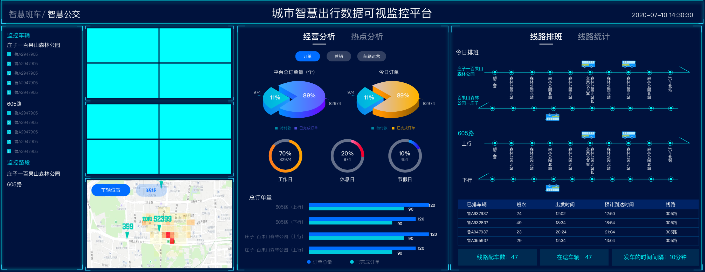
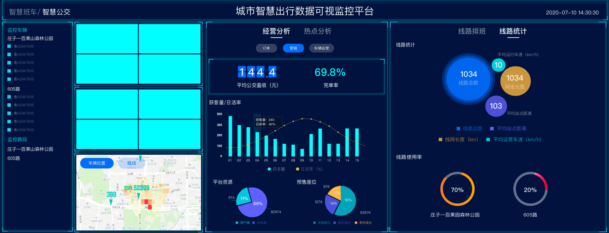
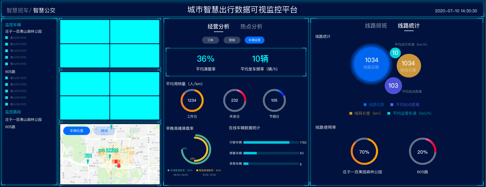

# 智慧城市出行大屏

## Project setup
```
npm install
```

### Compiles and hot-reloads for development
```
npm run serve
```

### Compiles and minifies for production
```
npm run build
```


1. 采用VueJs、Echarts开发
2. 大屏匹配25:10屏幕比例，支持自适应
   
## screenshot



